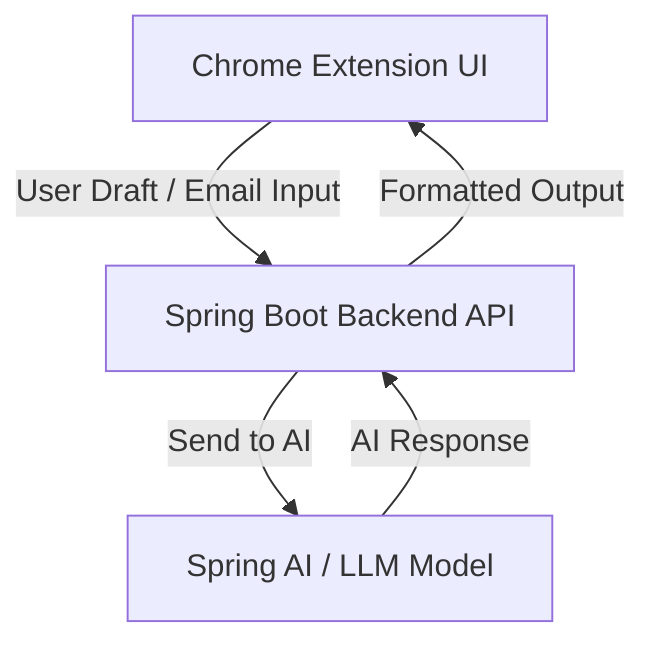

# 📧 AI Email Assistant (Spring Boot + Chrome Extension)

An AI-powered tool that helps you **rewrite emails more clearly** or **auto-generate replies** with just one click.
Built with **Spring Boot**, **Spring AI**, and a **Chrome Extension** for a smooth user experience.

---

## ✨ Features

* 🖊️ Rewrite emails for better clarity and professionalism
* 🤖 Auto-generate replies using AI
* 🌐 Chrome Extension frontend for easy access
* ⚡ Spring Boot backend API with Spring AI integration
* 🔒 Secure API usage with environment variables

---

## 🚀 What This Project Demonstrates About Me

* ✅ Strong knowledge of **Java & Spring Boot** for backend development
* ✅ Experience using **Spring AI** to integrate AI into real applications
* ✅ Built a **Chrome Extension** as a user-friendly frontend interface
* ✅ Ability to work with **REST APIs** and environment variables for secure API usage
* ✅ Problem-solving and initiative by turning a common problem (emails) into a working solution

---

## 🛠️ High-Level System Design

1. **Chrome Extension (Frontend UI)**

   * Provides a simple interface to draft or paste an email.
   * Buttons: *Rewrite with AI* ✨ and *Auto-Reply with AI* 📧.
   * Sends requests to the backend.

2. **Spring Boot Backend (API Layer)**

   * Defines endpoints like:

     * `POST /rewrite` → rewrites draft emails
     * `POST /auto-reply` → generates a reply based on email text

3. **Spring AI Integration**

   * Passes user input and system prompts to the AI model.
   * Retrieves high-quality rewritten or auto-reply text.

4. **Response Handling**

   * Backend sends formatted AI results back to the Chrome Extension.

5. **User Output**

   * User sees the improved email or generated reply instantly.

---

### 📊 System Design Diagram

---

## 🛠️ Tech Stack

* **Backend:** Java, Spring Boot, Spring AI
* **Frontend:** Chrome Extension (HTML, JS)
* **API Calls:** REST
* **AI Model:** OpenAI (via Spring AI)

---

## 🚦 How to Run Locally

1. Clone this repo
2. Run the Spring Boot backend (`mvn spring-boot:run`)
3. Add your API key in environment variables
4. Load the Chrome Extension in Developer Mode
5. Start writing & rewriting emails with AI!

---

## 💡 Why This Project?

We all struggle with email tone, wording, or time.
This project shows how I combined **AI + Spring Boot + Chrome Extension** to solve a real, everyday problem in a practical way.

